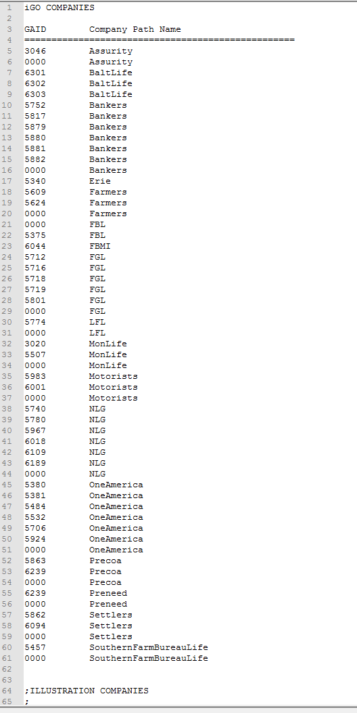

Notes on the IU_Chron_II.cmd files
===================================
###contact Keith MacKay (kmackay@ipipeline.com) with questions

1. If the current username is not '', then set the email address to send to {username}@ipipeline.com

2. Get all of the relevant lines of information from the GAID.DAT file (not the first 4, or anything that starts with a semicolon)

